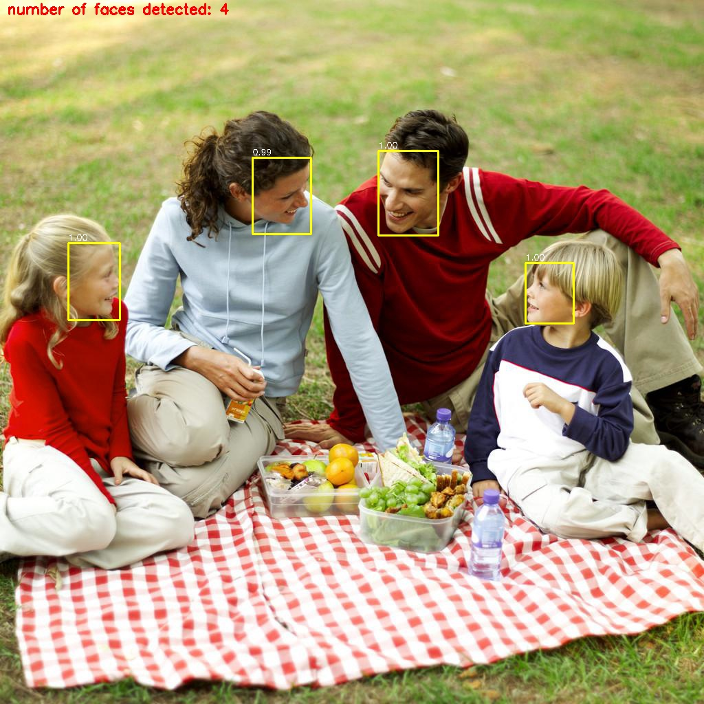

# Deep-learning-based-Face-detection

A robust face detection implementation leveraging the **YOLOv3 (You Only Look Once)** architecture and OpenCV's **Deep Neural Networks (dnn)** module. This project is optimized for real-time inference on images, video files, and live webcam feeds.

## Overview
This repository utilizes a YOLOv3 model pre-trained on the **WIDER FACE** dataset. By using the OpenCV `dnn` module, the project runs inference efficiently without needing a heavy Darknet installation, supporting models exported from TensorFlow or Keras.


---

## Prerequisites

Ensure you have Python 3.6+ installed. It is recommended to use a virtual environment to manage dependencies.

### 1. Setup Environment
```bash
# Install virtualenv
pip install virtualenv

# Create and activate environment
virtualenv venv
source venv/bin/activate  # On Windows use: venv\Scripts\activate
```

### 2. Install Dependencies
```bash
pip install -r requirements.txt
```
*Required: OpenCV (contrib), TensorFlow, Keras, NumPy, Matplotlib, Pillow.*

---

## Configuration

Before running the detection scripts, you must provide the pre-trained weights:

1. **Download Weights:** Download the `yolov3_wider_face.weights` file from [this link](https://drive.google.com/file/d/1xYasjU52whXMLT5MtF7RCPQkV66993oR/view?usp=sharing).
2. **Directory:** Place the downloaded file into the `model-weights/` directory within the project root.

---

## Usage

The `yoloface.py` script serves as the main entry point. Use the following flags to specify your input source:

### Image Inference
Processes a static image and saves the result to the output directory.
```bash
python yoloface.py --image samples/input.jpg --output-dir outputs/
```

### Video Inference
Processes a video file frame-by-frame.
```bash
python yoloface.py --video samples/input.mp4 --output-dir outputs/
```

### Live Webcam
Runs real-time face detection using your default camera.
```bash
python yoloface.py --src 0 --output-dir outputs/
```

---

## Results
The algorithm identifies faces with high confidence scores, even in crowded or poorly lit environments.



---

## License
Distributed under the **MIT License**. See `LICENSE.md` for more information.

## References
* [YOLOv3: An Incremental Improvement](https://pjreddie.com/media/files/papers/YOLOv3.pdf) - Joseph Redmon, Ali Farhadi.
* [WIDER FACE Dataset](http://mmlab.ie.cuhk.edu.hk/projects/WIDERFace/index.html) - For model training benchmarks.
